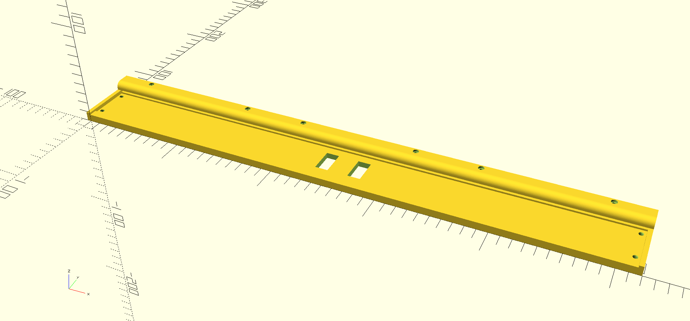

# LKP-Assy

Full assembly of LKP-Diva slider.

Based on the footprint of LKP-Diva v1.0.



## Usage

Make sure OpenSCAD 2019.05 is installed. To build everything, execute:

```sh
openscad -D 'TARGET="blocks"' lkp-assy-ex.scad -o lkp-assy-ex.stl
```

Then import `lkp-assy-ex.stl` to your slicer of choice. Split and/or rearrange the models if required.

Alternatively, use the Customizer. Set `Build Options/TARGET` to `blocks` and hit `Render` then `Export as STL`.

## Customizer

The customizer offers several options for adapting to slightly different components. Note that although efforts are made to reduce the surprises, non-default values are not thoroughly tested and may introduce unexpected behaviors. Proceed with caution and feel free to report uncaught broken values.

### Overlay thickness

Acrylic/PC sheets with thickness other than 2mm (~80mil) can be used by changing the `Slider Parameters/OVERLAY THICKNESS` option. Note that sheets that are too thick may make the capacitive sensor less sensitive. Test with the desired overlay thickness when in doubt.

### LED strip

The LED strip groove is modeled after BTF-Lighting WS2813 144LEDs/m strip. It is recommended to use strips that has internal filtering caps (like WS2813) due to space constraints. Several options related to LED strips can be found under `LED Strip Parameters`. To achieve best performance, make sure the all the color LED cells inside the package are aligned with the overlay. They can be located by lighting all the color up at a low intensity. Use `LED Strip Parameters/LED STRIP OFFSET` to change the offset for optimal alignment.

### Dummy

Dummies are used for testing the model extrusions. It can also be used as a tool to calibrate the LED positioning (see `LED strip` above). To build dummy models, set `Build Options/TARGET` to `dummy` and render normally.
